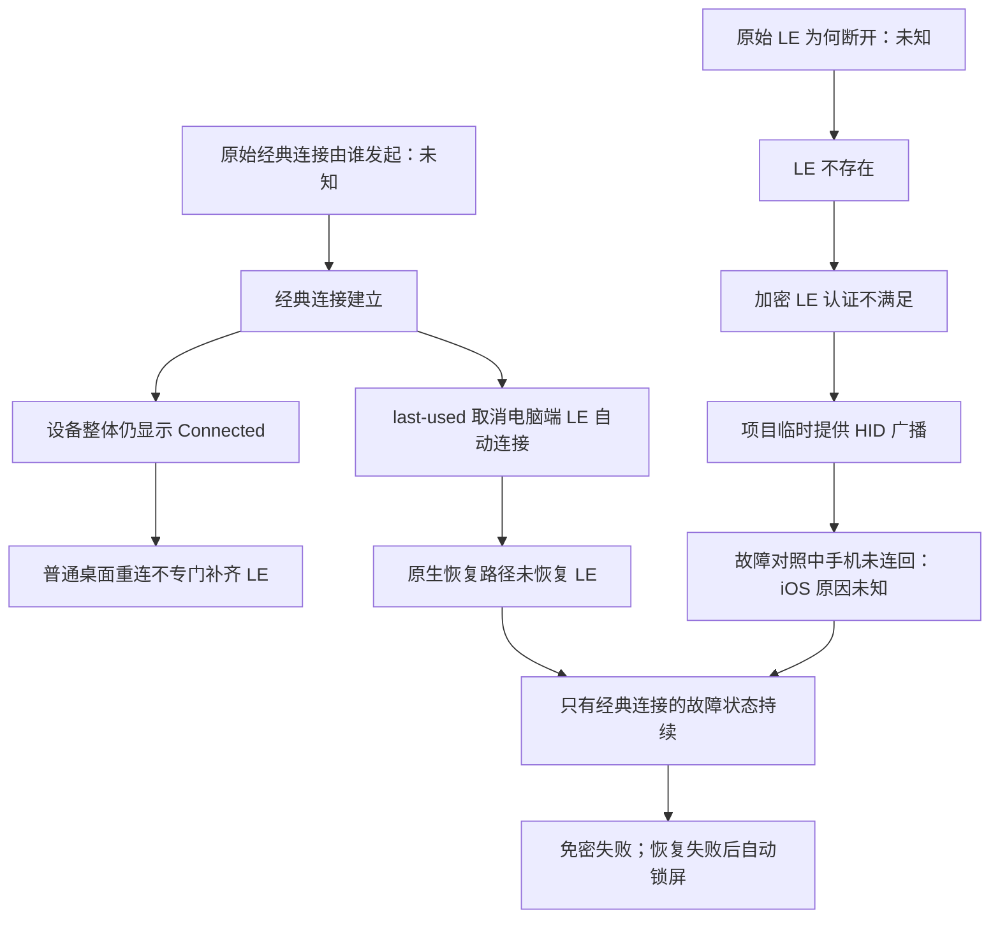

# 双模设备的 LE 恢复故障：背景、过程与结论

本专题记录 2026-09-15 的实机排查及后续归档。**已定位经典连接建立后影响电脑端 LE 自动恢复的机制，完成本机配对/策略处理，并验证实际免密解锁；未查明历史上最初是谁建立经典连接、谁断开 LE，以及 iPhone 当时为何不响应 HID 广播。** 不将修复成功反推成完整归因。

| 材料 | 用途 |
| --- | --- |
| 本文 | 背景、完整实验登记、按场景列出的结论、设计含义和未解决问题 |
| [复核手册与工具](../docs/le-bearer-recovery/REPRODUCE.md) | 准备条件、命令、变量控制、手机操作、恢复与离线验证 |
| [资料索引](../docs/le-bearer-recovery/REFERENCES.md) | BlueZ、Linux、Noctalia、bluer 等源码定位、固定版本和被否定的推断 |
| [证据来源与校验](LE_BEARER_RECOVERY.provenance.json) | 来源、完整性、脱敏、软件基线与公开产物校验值 |
| [初期采集 A](evidence/LE_BEARER_RECOVERY.initial.jsonl) | 18:44–18:59 留存的全部 114 条事件，编号 A0001–A0114 |
| [生命周期及策略采集 B](evidence/LE_BEARER_RECOVERY.lifecycle.jsonl) | 19:14–20:36 留存的全部 537 条事件，编号 B0001–B0537 |
| [关键事件摘选](evidence/LE_BEARER_RECOVERY.jsonl) | 后半程摘选；不代表完整采集 |
| [人工确认与历史摘要](evidence/LE_BEARER_RECOVERY.notes.json) | 用户操作、实际界面验证，以及缺少原始采集文件的背景 |

## 背景：需要解释的实际问题

项目已用 Rust 提供连接判定和按需连接，由 NixOS 接入 PAM、后台连接任务和 Noctalia 自动锁屏。此前 HID 登记、锁屏条件下短时重连、HID 注销后连接保持已有实测，见[早期报告](../RESULTS.md)和[HID 注销实验](../docs/HID_RELEASE.md)。这些结论不等于所有恢复场景都已覆盖。

用户报告：本次启动 greetd 曾免密登录成功；进入桌面后蓝牙显示已连接，但 Noctalia 按回车不能免密解锁，并多次自动锁屏。用户曾在桌面打开目标的 Auto reconnect；它与 LE 失联的先后关系未知。用户停止自动锁屏服务后，要求保留该停止状态，查明原因并让目标手机最终只使用 LE，同时保留电脑对其他设备的正常蓝牙能力。

当时另有 Keyring 解锁问题；它不作为本轮 LE 失联的因果证据，也不计入下面的修复验证。

### 运行逻辑与成功判据

- `query_connection` 查询内核，要求目标地址匹配、唯一已连接的 LE，以及加密标志。经典连接不满足认证条件。
- `query_or_connect` 先查询；需要连接时，在锁和时间预算内临时注册 HID、广播并等手机连回，结束后释放资源。**此版本没有显式调用 BlueZ 的 LE bearer Connect。**
- PAM 使用纯查询/异步触发模式；缺少 LE 时本次走密码认证。自动锁屏程序尝试恢复 LE，仍失败且桌面未锁定时执行锁屏。
- 普通桌面的设备 Connected 状态不能替代加密 LE 判据。经典与 LE 是两个 bearer，同一设备可以同时有两条连接。

### 环境与初始条件

| 项目 | 记录 |
| --- | --- |
| 系统/内核 | NixOS；运行内核 `7.2.4-cachyos-lto` |
| BlueZ | 5.87；正常配置为双模、未永久启用 experimental D-Bus API |
| Noctalia | 5.1.0；固定 revision 和源码哈希见资料索引 |
| Rust 蓝牙库 | bluer 0.17.4 |
| 历史采集脚本 | Python 3.10；部分调用复用已安装 Rust 可执行程序 |
| 手机 | iPhone，使用系统功能；型号、iOS 版本未可靠记录，不按地址推断 |
| 控制器 | 本轮 hci0；不假定第二只适配器，未归档型号 |
| 配对 | 用户确认此前在 HID server 运行时登记；实查同时存在 LE 密钥与经典 LinkKey，来源不能再细分 |
| 默认设备策略 | `PreferredBearer=last-used`；初始 `Trusted=true` |
| 首次纳入 HCI 采集时 | 只有经典连接，没有目标 LE；原始转变发生在采集开始前 |

## 因果图：已知机制与缺失起点

两个起点及其先后次序未知。`last-used` 的队列变化发生在经典连接建立之后，**不能解释最初是谁建立经典连接，也不能证明 iPhone 入站 HID 连接被阻止。**

## 全部过程登记

时间均为 UTC+08:00。区间用于定位，不将等待上限当作连接耗时。A/B 编号可在对应 JSONL 搜索；没有事件文件的部分标为人工确认或过程摘要。

| ID / 时段 | 场景、操作与变量 | 观察结果及归因范围 | 证据 |
| --- | --- | --- | --- |
| R00 / 采集前 | greetd 曾免密通过；桌面后来仅经典、解锁失败、反复锁屏；用户提到 Auto reconnect | 不能还原初次经典建链/LE 断开的顺序或发起者 | notes：U01–U03、J01 |
| R01 / 18:44–18:45 | 临时取消 Trusted，断目标连接，提供 HID 等待 15 秒 | 无 LE；恢复 Trusted。不是重新配对试验 | A0001–A0026 |
| R02 / 18:46 | Trusted 恢复后再次提供 HID 等待 15 秒 | 仍无 LE；Trusted=true 不足以保证这次广播恢复 | A0027–A0042 |
| R03 / 18:48 | 仅读目标配对元数据 | LE 长期密钥/IRK 与 LinkKey 均存在；记录的 LE 加密长度为 16；未发布密钥 | A0046–A0048 |
| R04 / 18:49–18:51 | HID 广播窗口内，用户点击手机原配对条目 | 用户显示已连接；HCI 表明手机发起经典，LE 未建立，窗口结束失败 | A0049–A0066；U04 |
| R05 / 18:52–18:53 | HID 广播内，用户在 iPhone 设置中关蓝牙约 3 秒再开、随后锁屏，不点电脑 | 建立加密 LE，电脑为 peripheral；保留原配对 | A0067–A0086；U05 |
| R06 / 18:53–18:55 | 已有 LE 时将 Trusted 关后再开 | 原 LE 保持；未观察到切换直接断线 | A0087–A0097 |
| R07 / 18:56–18:59 | 已有 LE 时调用通用 Device1.Connect | 电脑新增经典，两条加密连接同时保持；不符合最终只要 LE 的要求 | A0098–A0114 |
| R08 / 19:15 | MGMT 按类型只断经典 | LE 保持。早期无接口名的 Connected=false 被误读，后纠正 | B0001–B0010 |
| R09 / 19:17–19:20 | 在已有 LE 上持有与生产相同的 Rust HID | 观察到 Service Changed、确认及 ATT 请求，不是只看旧连接标志 | B0011–B0039 |
| R10 / 19:20 | HID 仍持有时仅断 LE | 手机迅速重连并加密 | B0040–B0074 |
| R11 / 19:20–19:21 | 退出持有器、观察注销，再断 LE 并立即运行原按需程序 | 新注册的短命 HID 同样成功；不能据此要求常驻 HID | B0075–B0135 |
| R12 / 19:23–19:24 | 计划断 LE 后无 HID 静置，再启动程序 | 静置中系统已主动建立 LE；后来程序只查询就成功。不能算静置后 HID 重连成功 | B0136–B0167 |
| R13 / 19:40 | 临时启用 experimental 并尝试隔离自动服务 | runtime mask 未阻止 NixOS 现有单元，启动 HID 仍参与；不能归因于新 API | B0168–B0215；N01 |
| R14 / 19:43–19:44 | 断 LE 后显式调用 Bearer.LE1.Connect | 此次 D-Bus 调用 8 秒超时，未完成加密；不能宣称显式方法本身已可靠 | B0216–B0230 |
| R15 / 19:50 | 不操作手机，将偏好设为 le | 电脑主动建立加密 LE；原生发起路径的正向证据 | B0231–B0253 |
| R16 / 19:54–19:57 | 偏好改为 bredr 后断 LE，随后单独运行 HID 流程 | 无 HID 时未恢复，广播后手机仍能连回；否定“bredr 必然阻止入站 LE” | B0254–B0300；N02 |
| R17 / 19:59–20:00 | 新增经典后仅断 LE，再尝试 HID | 诊断期限到时清理/重启 BlueZ，打断试验；不判机制失败或通过 | B0301–B0334；N03 |
| R18 / 20:06–20:09 | 修复上轮未完成清理；无目标连接时持续提供 HID | 窗口内仍无 LE。上轮清理失败是 socket 启动时连接 oneshot 已运行，不是配对丢失 | B0335–B0351 |
| R19 / 20:11 | 用实际生效的 ConditionPathExists 隔离自动任务，Trusted=false；无 HID，偏好改 le | 电脑主动发起，约 3.6 秒完成加密；无后台 HID 混入 | B0352–B0376；N04 |
| R20 / 20:12 | le 偏好下保留经典，再仅断 LE | 约 1.6 秒恢复加密；经典不是必然的 LE 建链阻挡条件 | B0377–B0409 |
| R21 / 20:13–20:14 | 恢复 last-used；重新建立经典使其成为最近通道；断 LE，运行原程序 15 秒 | 无 LE，退出 1，经典保持；复现目标故障状态 | B0410–B0432；N05 |
| R22 / 20:15 | 同一失败状态仅改 le，不操作手机、不重新配对 | 原生恢复加密；首次 LE 在加密前被主机断开，第二次才加密，不能写成一次立即成功 | B0433–B0459 |
| R23 / 20:16–20:27 | 先断经典；经用户批准只移除经典配对部分 | LinkKey 消失，LE 密钥比对不变，原 LE 未断；私有备份删除 | B0460–B0467；U06 |
| R24 / 20:28 | 撤除实验参数/隔离，恢复 Trusted/正常服务，重启 BlueZ | 原 HID 流程约 1 秒恢复仅加密 LE，电脑为 peripheral | B0468–B0499 |
| R25 / 20:29–20:30 | 正常环境仅断 LE，运行原程序，预算 7000 ms | 约 0.65 秒退出 0；仅加密 LE；随后 HID/广播撤销 | B0500–B0533 |
| R26 / 20:34–结束 | 复核持久配对/资源，空密码 PAM 检查，用户手动锁屏按回车 | LinkKey 不在、LE 密钥组保留、偏好 le、Trusted=true；PAM/界面通过；诊断退出后 LE 仍在 | B0534–B0537；U07、N06 |

### 必须保留的观测缺陷

- **接口归属遗漏：** A 的 dbus_target_properties 和 B 早期部分 device_properties 无接口名。同一路径可提供 Device1、Bearer.LE1、Bearer.BREDR1，不能把任意 Connected=false 都解释为整体断开。后续带接口事件和 HCI 表纠正了误读。
- **D-Bus 不完整：** B0536 在清理时报告单行长度超限，不代表恰在清理时才开始漏记。BlueZ owner 切换也未可靠覆盖。不能以缺少方法记录证明没人调用。
- **HCI 归属：** 旧采集器部分 LE Complete/Create 无独立目标匹配标记，必须结合附近按目标身份过滤的连接表核对 handle；handle 会复用，不能孤立归因。
- **对照被干扰：** R13 的 runtime mask、R17 的定时清理未满足控制目标；R12 静置中已恢复，也不满足原前提。全部保留，不合并为成功率。
- 新归档工具修复了采集缺陷，但**没有用新版工具重跑本轮实机**，不能把其能力倒算给旧记录。

## 按实际场景列出的全部结论

1. **HID 登记后为何仍能经典连接：** R03 有两种密钥，说明这份配对不是 LE 专属；注册 HID 不删除经典配对。经典密钥生成来源未知。
2. **已连接却免密失败、反复锁屏：** 只有经典时整体可显示 Connected，加密 LE 判据不成立；恢复失败后锁屏。这解释界面/认证差异，不是 query_connection 误判有效 LE 的证据。
3. **桌面普通 Connect：** R07/R20 在已有 LE 时新增经典，未立即断 LE。通用接口不是 LE-only 请求；历史调用者未确认。
4. **手机点击原条目：** R04 建立经典。普通手机连接操作不能保证选择 HID/LE；不据此认定用户在原始故障做过相同操作。
5. **Noctalia Auto reconnect：** setter 仅写 Trusted；R06 未见切换直接断 LE。它不是通道开关；另行重连逻辑选择已配对、Trusted 且整体未连接的设备，使用通用 Connect。
6. **默认策略下新增经典：** last-used 转换取消目标电脑端 LE 自动连接。变化发生在经典建链之后，不能解释最初两个事件是谁触发。
7. **只剩经典迟迟不恢复：** 原生 LE 自动连接被取消，桌面仍视设备已连接；R21 的 HID 广播也未恢复。因此故障状态可以持续。
8. **HID 广播是否必然恢复：** R01/R02/R04/R18/R21 未恢复，其他轮次成功。路径依赖手机响应，iOS 不响应原因未知；不能把队列取消解释为禁止手机入站 LE。
9. **电脑能否主动建立加密 LE：** R19 隔离 HID 后成功，电脑为 central。以前“电脑不能主动建立 LE”的结论应撤回。未证明 iPhone 在此角色下完成全部 HID 业务，也未证明每次 Bearer.LE1.Connect 都可靠（R14 失败）。
10. **经典与 LE 是否互斥：** R07/R20/R22 证明可同时保持。删经典配对不是恢复 LE 的唯一方法，而是满足本轮只使用 LE 的要求。
11. **固定 le 是否禁止经典：** 不禁止。setter 可启用原生自动连接，偏好会保存；只加载保存值不保证自动连接队列重建，最终正常验证走原 HID 流程。
12. **仅断经典是否足够：** 不足，旧密钥还在仍可重新建立经典加密连接。本轮批准后删目标 LinkKey；不禁止将来新经典配对，项目未新增自动清理/禁止经典的通用功能。
13. **HID 退出是否必须断 LE：** R11/R25 及最终检查支持退出后保留连接。服务生命周期与底层连接生命周期不能混为一谈，不能以此要求 HID 常驻。
14. **正常服务重启后是否有效：** R24/R25 使用原 BlueZ 参数/原 Rust 程序通过，PAM 和用户实际解锁通过。不替代整机重启、远离返回或挂起恢复试验。
15. **显示 LE1 接口是否可调用其 Connect：** 不保证；未启用 experimental 时可只暴露信号，需核对方法/属性，不能只看接口名。
16. **Blocked / MGMT BlockDevice 可否仅挡经典：** 本轮仅源码核查、未执行。BlueZ 5.87 会将相关事件收敛到整台 Device1 的阻止，可能影响 LE；不能代替按类型移除经典密钥。
17. **其他被考虑的解释：** WirePlumber 音频 profile 策略不等于 BR ACL 拒绝；本地 Privacy 默认值不等于不能解析对端 IRK；Rust 未检查请求 link 只说明 BR ATT 访问可能，未观察到 iPhone 将 HOGP 迁往 BR。这些均不能当成本次已证实原因。
18. **原始失联原因：** 初始经典发起者、初始 LE 断开原因/顺序、经典密钥来源、iOS 不响应广播原因均未查明。不能用受控断开、改偏好或修复成功补造历史因果。

## 对后续设计的明确指导

| 设计问题 | 可以依据本轮作出的决定 | 不能直接推出的改动 |
| --- | --- | --- |
| 认证判据 | 区分加密 LE 与整体 Connected；没有支持放宽判据的证据 | 仅因 UI 已连接就认证成功 |
| 连接实现 | HID 有成功也有已复现失败；原生电脑发起 LE 是另一个已验证方向，值得独立设计/验证 | 认定已实现稳定 native fallback，或 setter 可无条件替换整个函数 |
| LE-only | 登记/配置阶段应明确双模配对和偏好；本机处理是有前提的运维经验 | 静默删所有用户经典配对、关闭整只适配器经典能力，或假定 HID 排他 |
| 常驻 | 已建连接保持不构成必须常驻 HID 的理由 | 将短测外推所有恢复和长期稳定性 |
| 自动锁屏 | 区分真实 LE 不在和 UI 在线；调试可单独暂停自动锁屏 | 为避免误锁而接受经典，或把已停止的自动锁屏写成长期验证通过 |
| 查最初触发者 | 触发前同时记录方法调用 PID/程序名、带接口属性、HCI 主机命令/断开、手机操作 | 再列无调用归属的成功失败，就声称查明原始起因 |

## 实际处理、持久影响与清理边界

仅改目标配对/偏好：保存 le，经批准移除经典 LinkKey，恢复 Trusted=true。LE 密钥逐项比对不变。没有修改生产 Rust 认证代码，也没有为所有设备增加经典拒绝规则；电脑双模能力和其他设备配对保留。

移除使用 MGMT Unpair Device，类型 BR/EDR（0）、Disconnect=0，执行前经典已断、加密 LE 存在。B0466 的 BREDR Paired=false、Bonded 仍为 true 是当时属性快照；不能单凭它推翻内核操作、持久 LinkKey 删除及 LE 保持的核验。B0534 再次确认 LinkKey 不存在。

临时 experimental 参数、服务隔离覆盖、HID/广播、私有密钥备份已撤除，诊断进程退出。正常连接服务、socket、电源监听恢复；自动锁屏按用户要求停止。公开归档不含配对备份、原始 HCI 数据包、地址、设备名称、个人路径或密码。

**以后重新登记可能重新产生经典配对；本机修复不是已发布的通用代码修复。** 本轮仅重启 BlueZ，没有新的整机重启验证，进一步实现需按上述证据和未知项独立决策。
